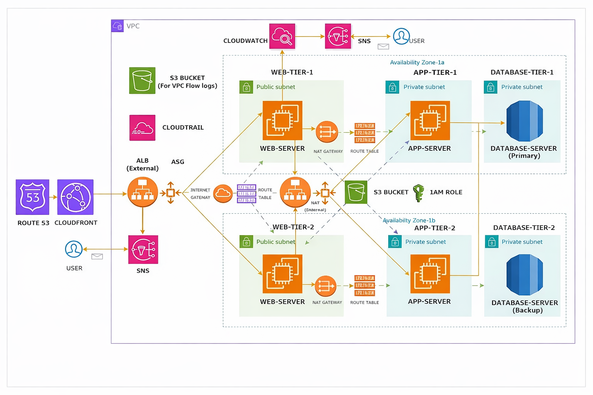

# 🏗️ AWS 3-Tier High Availability Architecture


A production-grade, highly available three-tier web application deployed on AWS — spanning two Availability Zones with Auto Scaling, Multi-AZ RDS, internal load balancing, and full observability via CloudWatch, SNS, and CloudTrail.

---

## 📐 Architecture Diagram



---
## ⚙️ Tech Stack

| Layer | Technology |
|---|---|
| DNS & CDN | Route 53 + CloudFront |
| Load Balancing | External ALB (Internet-facing) + Internal ALB |
| Web Tier | Nginx + Node.js (React frontend) — Public Subnets |
| App Tier | Nginx + MySQL Client — Private Subnets |
| Database Tier | Amazon RDS MySQL (Multi-AZ) — Private Subnets |
| Auto Scaling | ASG on Web Tier + App Tier (Target Tracking — CPU 70%) |
| Compute | EC2 (AMI → Launch Template → Auto Scaling Group) |
| Storage | S3 (Application Code + VPC Flow Logs) |
| IAM | IAM Role — S3ReadOnly + SSMManagedInstanceCore |
| Monitoring | CloudWatch Alarms + SNS Email Alerts |
| Audit | CloudTrail + VPC Flow Logs |

---

## 🌐 Traffic Flow

```
User
 └──▶ Route 53 (DNS)
       └──▶ CloudFront (CDN)
             └──▶ External ALB (Internet-facing)
                   └──▶ Web Server — Nginx + Node.js (AZ-1a or AZ-1b)
                         └──▶ Internal ALB (Private)
                               └──▶ App Server — Node.js API (AZ-1a or AZ-1b)
                                     └──▶ Amazon RDS MySQL (Primary → Failover to Backup)
```

---

## 🗺️ Network Topology

**VPC CIDR:** `172.16.0.0/16`

| Subnet Name | Availability Zone | Type | CIDR |
|---|---|---|---|
| web-tier-public-1a | AZ-1a | Public | 172.16.0.0/24 |
| web-tier-public-1b | AZ-1b | Public | 172.16.1.0/24 |
| app-tier-private-1a | AZ-1a | Private | 172.16.2.0/24 |
| app-tier-private-1b | AZ-1b | Private | 172.16.3.0/24 |
| db-tier-private-1a | AZ-1a | Private | 172.16.4.0/24 |
| db-tier-private-1b | AZ-1b | Private | 172.16.5.0/24 |

- **Internet Gateway** → attached to VPC for public subnet outbound/inbound
- **NAT Gateway** → placed in public subnet, routes private subnet outbound traffic
- **Public Route Table** → 0.0.0.0/0 via Internet Gateway
- **Private Route Table** → 0.0.0.0/0 via NAT Gateway

---

## 🔒 Security Group Chain

Each tier only accepts traffic from the tier **directly above it** — no tier is ever open to the internet directly.

```
Internet (0.0.0.0/0)
   └──▶ external-load-balancer-sg   [HTTP :80]
         └──▶ web-tier-sg           [HTTP :80]
               └──▶ internal-load-balancer-sg  [HTTP :80]
                     └──▶ app-tier-sg          [TCP :4000]
                           └──▶ db-tier-sg     [MySQL :3306]
```

---

## 🚀 Deployment Steps (Summary)

> 📄 For the complete step-by-step guide with all commands and screenshots, see [`docs/deployment-guide.docx`](docs/deployment_guide.pdf)

1. **Download code** to local system
2. **Create two S3 buckets** — one for app code, one for VPC Flow Logs. Upload code.
3. **Create IAM Role** — attach `AmazonS3ReadOnlyAccess` + `AmazonSSMManagedInstanceCore`
4. **Create VPC** (VPC Only) with 6 subnets, IGW, NAT Gateway, and route tables
5. **Create 5 Security Groups** in the chain described above
6. **Create DB Subnet Group + RDS** — MySQL, Multi-AZ, Private Subnets, No Public Access
7. **Set up App Server** — install Node.js + MySQL client, pull code from S3, start with PM2, create AMI → Launch Template → Internal ALB → ASG
8. **Set up Web Server** — install Nginx + Node.js, build React app, configure Nginx proxy, create AMI → Launch Template → External ALB → ASG
9. **Create Route 53 A Record** — Alias to External ALB
10. **Create CloudWatch Alarms + SNS Topic** — CPU alerts to email
11. **Enable CloudTrail** — full API audit logging to S3

---

## 💻 Key Configuration Snippets

### Nginx Configuration (Web Tier)

```nginx
server {
    listen 80;
    root /home/ec2-user/web-tier/build;
    index index.html;

    # React Router support
    location / {
        try_files $uri $uri/ /index.html;
    }

    # Proxy API requests to Internal ALB
    location /api/ {
        proxy_pass http://<INTERNAL-ALB-DNS>/;
        proxy_http_version 1.1;
        proxy_set_header Host $host;
        proxy_set_header X-Real-IP $remote_addr;
    }
}
```

### Node.js Install (via NVM)

```bash
curl -o- https://raw.githubusercontent.com/nvm-sh/nvm/v0.39.7/install.sh | bash
source ~/.bashrc
nvm install 16
nvm use 16
```

### Start App Server with PM2

```bash
npm install -g pm2
pm2 start index.js
pm2 save
pm2 startup
```

### S3 Code Pull (on EC2 via IAM Role)

```bash
aws s3 cp s3://<YOUR-CODE-BUCKET>/app-tier/ /home/ec2-user/app-tier/ --recursive
aws s3 cp s3://<YOUR-CODE-BUCKET>/web-tier/ /home/ec2-user/web-tier/ --recursive
```

---

## 🏛️ AWS Services Used

| Service | Purpose |
|---|---|
| **EC2** | Web and App server instances |
| **AMI** | Golden images for Launch Templates |
| **Auto Scaling Groups** | Automatic scaling + AZ distribution |
| **Application Load Balancer** | External (internet-facing) + Internal |
| **Amazon RDS** | MySQL database with Multi-AZ failover |
| **VPC** | Isolated network with public/private subnets |
| **Internet Gateway** | Public subnet internet access |
| **NAT Gateway** | Private subnet outbound-only internet access |
| **Route 53** | DNS + ALB alias record |
| **CloudFront** | CDN + DDoS protection layer |
| **S3** | Application code storage + Flow Log destination |
| **IAM** | Least-privilege role for EC2 instances |
| **Systems Manager** | Session Manager — SSH-free instance access |
| **CloudWatch** | Metrics, alarms, and dashboards |
| **SNS** | Email alerts on CloudWatch alarm triggers |
| **CloudTrail** | API audit logging |
| **VPC Flow Logs** | Network traffic metadata logging |

---

## 📋 Prerequisites

- AWS account with sufficient IAM permissions
- AWS CLI installed and configured locally
- Git installed locally
- A registered domain (for Route 53 configuration)
- Application code (web-tier + app-tier) ready to deploy

---

## 📬 Contact

**Praveen Pandarinathan**
📧 [praveenpandarinathan.gmail.com](mailto:praveenpandarinathan.gmail.com)
🔗 [LinkedIn](https://www.linkedin.com/in/) ← *(add your LinkedIn profile URL here)*

Feel free to open an issue, fork the repo, or reach out directly if you have questions about the architecture or deployment process.

---

## ⭐ If this project helped you

Give it a star ⭐ — it helps others find this repo and motivates more open-source documentation like this.

---

*Built with AWS | Documented for the community*
